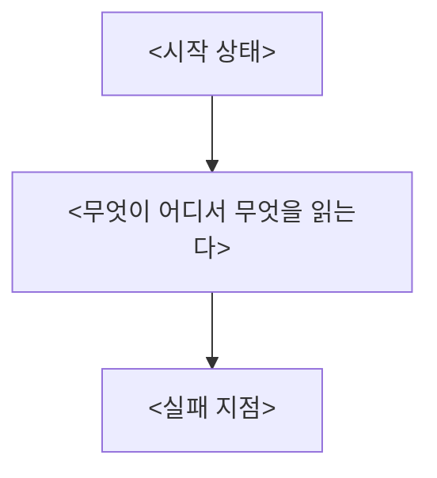

# <제목> — 결정 요청

<정본이 있으면: 이 문서는 [`plan.md`](./plan.md)에서 파생된 한국어 요약이다. 정본은 `plan.md` 이고, 둘이 어긋나면 영문 쪽이 맞다.>

## 결론

**<추천안 한 문장.>** <그 결론이 서는 사실 한두 문장.>

## 무슨 일이 일어나고 있나

<다이어그램이 못 담는 것 한두 문장 — 언제·어떻게 확인했나(날짜, 방법).>

## 결정해 주셔야 하는 것

| | A안 — <제목> (추천) | B안 — <제목> |
|---|---|---|
| 바꾸는 것 | | |
| 코드 변경 | | |
| 영향 범위 | | |
| 필요한 것 | | |
| 위험 | | |

**선택 이유 — A안.** <대안이 버리는 것을 한 문장으로.>

## 하지 않은 것

- **<하지 않은 일>.** <이유 한 문장.>
- **별건 제안.** <이번 건과 무관해 손대지 않은 것.>
