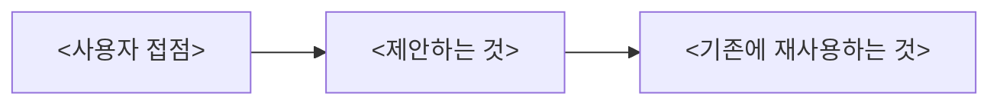

# <제안 제목>

<한 줄 요약: 무엇을, 누구에게, 왜 지금. 제약선(예산·기간·범위)이 있으면 여기에 숫자로.>

## 1. 배경 — 무엇이 문제인가

- <현재 상태 한 줄>
- <그것이 만드는 비용 또는 위험 한 줄, 출처 포함>
- <왜 지금인가 한 줄>

## 2. 제안 구조

<다이어그램이 못 담는 것: 어디까지가 신규이고 어디부터 재사용인지 한 문장.>

## 3. 범위

| 구분 | 항목 | 비고 |
|---|---|---|
| 신규 | | |
| 재사용 | | 운영 검증 여부 |
| 제외 | | 제외 이유 |

## 4. 기대 효과

| 관점 | 효과 | 어떻게 확인하나 |
|---|---|---|
| 사용자 | | |
| 운영·개발 | | |
| 비즈니스 | | |

## 5. 일정과 비용

| 단계 | 산출물 | 기간 | 비용 |
|---|---|---|---|
| | | | |

## 6. 리스크

| 리스크 | 영향 | 대응 |
|---|---|---|
| | | |

## 7. 결정 요청

| | 추천안 | 대안 |
|---|---|---|
| 내용 | | |
| 비용·위험 | | |

**선택 이유.** <한두 문장.>
