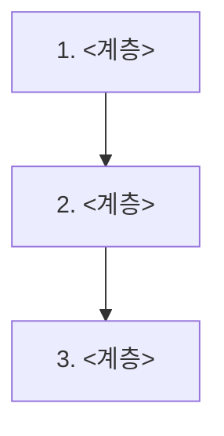
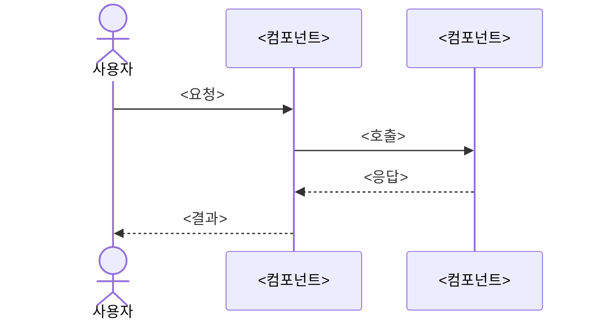

# <시스템 이름> — 구조 개요

<이 문서가 답하는 질문 한 줄. 소스 문서와 날짜.>

## 1. 구조



<이 문서가 다루는 범위가 어느 계층인지 한 문장.>

## 2. 요청 하나의 흐름



## 3. 경계 — 무엇이 어디에 있나

```text
<root>/
├── <module>/     # <책임 한 줄>
├── <module>/     # <책임 한 줄>
└── <module>/     # <책임 한 줄>
```

| 경계 | 이쪽 | 저쪽 | 넘는 방식 |
|---|---|---|---|
| | | | |

## 4. 용어

| 용어 | 뜻 | 어디서 쓰나 |
|---|---|---|
| | | |
